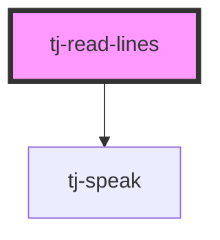

# tj-read-lines

<!-- Auto Generated Below -->

## Properties

| Property   | Attribute    | Description | Type     | Default   |
| ---------- | ------------ | ----------- | -------- | --------- |
| `setLang`  | `set-lang`   |             | `string` | `'en-CA'` |
| `sourceID` | `source-i-d` |             | `string` | `''`      |

## Dependencies

### Depends on

- [tj-speak](../speak)

### Graph

----------------------------------------------

*Built with [StencilJS](https://stenciljs.com/)*
