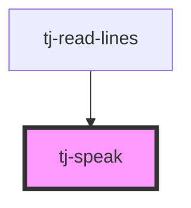

# tj-speak

<!-- Auto Generated Below -->

## Properties

| Property  | Attribute  | Description | Type     | Default   |
| --------- | ---------- | ----------- | -------- | --------- |
| `setLang` | `set-lang` |             | `string` | `'en-CA'` |

## Dependencies

### Used by

 - [tj-read-lines](../read-lines)

### Graph

----------------------------------------------

*Built with [StencilJS](https://stenciljs.com/)*
